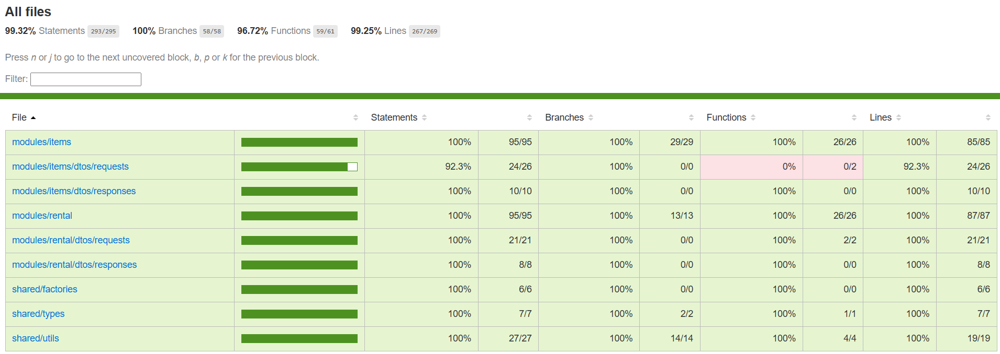

# Peer-to-Peer Rental Platform Backend

This project is a simple backend service for a peer-to-peer rental platform. It allows users to list items for rent, search for available items, and manage rentals. 

## Features
- **List an Item**: Users can add items available for rent, including details like item name, description, price per day, and availability.
- **Search Items**: Users can search for items based on name or price range.
- **Rent an Item**: Mark an item as rented for a specific date range.
- **Return an Item**: Mark the item as returned and make it available again for rent.

## Bonus Features
 - **Overlapping Rental Dates**: The platform handles overlapping rental dates to prevent double-booking items.

## Technologies
- Typescript
- Node.js (Nest.js)
- In-Memory Storage
- Jest
- Swagger

## Setup Instructions with Docker

1. Clone the repository: `git clone https://github.com/AndriyCh1/tt-rental-platform-backend rental-platform-backend`
2. Navigate to the project directory: `cd rental-platform-backend`
3. Create a `.env` file and fill in the values described in `.env.example`.
4. Run the Docker Compose file: `docker-compose up -d`
5. Access the Swagger UI at: http://localhost:{PORT}/swagger/

## Setup Instructions with pnpm
**1. Install `pnpm` Package Manager**

```bash
npm install -g pnpm@latest-10
```

**2. Clone the Repository**

```bash
git clone https://github.com/AndriyCh1/tt-rental-platform-backend rental-platform-backend
```

**3. Install Dependencies**

Navigate to the project directory and install the dependencies using pnpm:

```bash
cd rental-platform-backend
pnpm i
```

**4. Configure `.env` File**

Create a `.env` file and fill in the values described in `.env.example`.

**5. Start the Development Server**
```bash 
pnpm run start:dev
```

##  Testing the API

The easiest way to test the API is through Swagger. You can access the Swagger UI at: http://localhost:{PORT}/swagger/ (Update the port number if needed based on your `.env` configuration).

The Swagger UI will provide descriptions of the available endpoints and their parameters.

Alternatively, you can also use tools like Postman to interact with the API.

To help with testing, a Seeder Controller has been included to populate the in-memory storage with some items. You can access it at: http://localhost:{PORT}/swagger#/API%20Seeder.


## Solution and thought process

### Domain entities and Business logic
**The main entities in the project are**:

 - Item: Represents items listed by users for rent.
 - Rental: Represents rentals and their statuses, including specified date ranges.

**Business Workflow**:

- The owner creates a listing, specifying item details and personal contact information.
  `POST /items`
- Renters browse all available items (with filtering and sorting options) and select an item to rent.
  `GET /items`
- The renter submits a rental request. The rental is created and marked as "pending".
  `POST /rentals/items/:itemId`
- The owner accepts or rejects the request, and the rental status is updated accordingly - "approved" or "declined".
  `PATCH /rentals/:id/status` Status: "approved" or "declined"
- The renter makes a payment and the item is marked as "reserved" (with no payment integration, only teh owner can update the status).
  `PATCH /rentals/:id/status` Status: "reserved"
- The renter returns the item and the owner updates the rental status to "returned".
  `PATCH /rentals/:id/status` Status: "returned"

**Edge Cases Handled**

- Items not found
- Invalid date ranges
- Overlapping rental dates

Dates are stored in UTC format to ensure consistency across systems.

In a real-world system, the late returns should be also handled - owner and renter should be notified, and if the item has subsequent reservations, it should notify affected renters.

### Architecture  

The API is built following a common n-layer architecture with `Controllers`, `Services`, and `Repositories`. Each layer has a distinct responsibility: 
- Controllers: requests handling and validation.
- Services: contain the business logic.
- Repositories: manage data interactions (in this case,  with in-memory storage).

### Structure

The project follows a modular structure to promote high cohesion and low coupling, making it easier to maintain and scale. The project contains the following modules:

- Items Module: handles listing and searching for items.
- Rental Module: manages rentals and rental actions.
- Seeder Module: provides a way to seed data into in-memory storage for testing purposes.
- Main Module: the main entry point for the application.

### Test Coverage

The project has a 99% unit test coverage.
